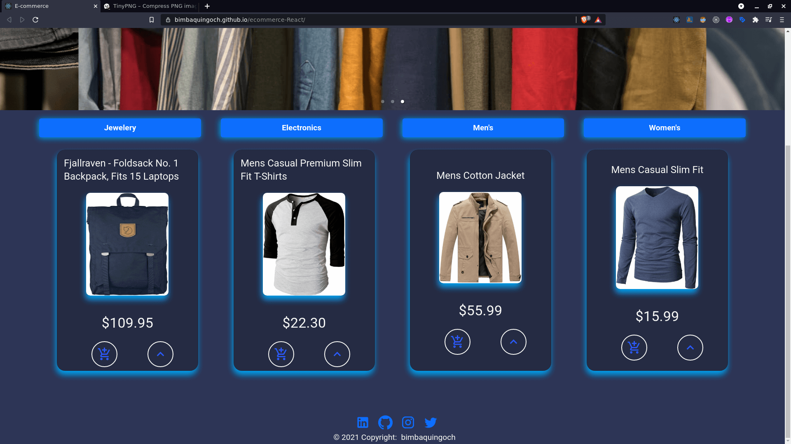

<h1 align="center">Welcome to ecommerce 👋</h1>
<p>
  <a href="https://twitter.com/bryandresimba" target="_blank">
    
  </a>
  
</p>

> Ecommerce React, material UI y firebase

## Install

```sh
npm install
```

## Usage

```sh
npm start
```

## Author

👤 **Bryan Imbaquingo**

- Twitter: [@bryandresimba](https://twitter.com/bryandresimba)
- Github: [@bimbaquingoch](https://github.com/bimbaquingoch)

## Show your support

Give a ⭐️ if this project helped you!

---

_This README was generated with ❤️ by [readme-md-generator](https://github.com/kefranabg/readme-md-generator)_
